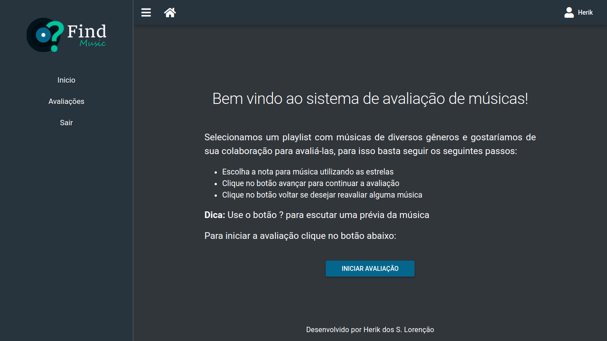
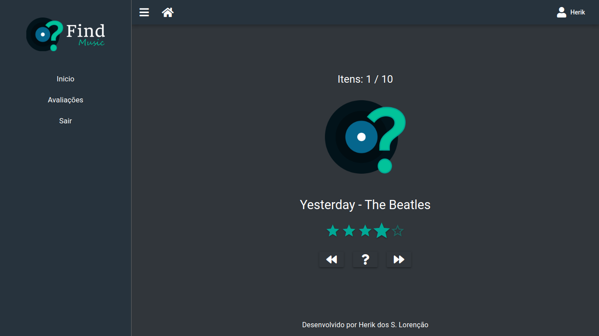

# Find Music

Aplicação web para captura de avaliações e uso por usuários de perfil avaliador na recomendação de músicas. Esse sistema é parte da arquitetura do [Sistema de Recomendação Híbrido](https://github.com/herikLorencao/srh-backend) desenvolvido no trabalho de conclusão de curso de Sistemas de Informação do IFES - Campus Cachoeiro de Itapemirim no ano de 2020/2021.

## Funcionalidades

O cliente de recomendação busca permitir que usuários de **perfil avaliador** possam realizar suas tarefas, permitindo a geração de avaliações e manutenção de seus cadastros. Segue abaixo a demonstração de algumas telas do sistema:





## Utilização básica do sistema

Para uso do sistema basta clonar esse repositório com o seguinte comando:

```bash
git clone git@github.com:herikLorencao/srh-findbymusic.git
```

Após esse passo é necessário a instalação das dependências, para isso é necessário que as seguintes ferramentas estejam instaladas em sua máquina:

- [Node JS](https://nodejs.org/pt-br/)
- [Yarn](https://yarnpkg.com/)
- [Quasar CLI](https://quasar.dev/quasar-cli/installation)

### Configuração do projeto

Para instalar as dependências do projeto execute o seguinte comando:

```bash
yarn
```

### Habilitando modo de desenvolvimento (hot reload e debug)

Para utilizar o modo de desenvolvimento execute o seguinte comando:

```bash
quasar dev
```

### Compilar projeto para produção

Para gerar uma nova versão de produção do projeto execute o seguinte comando:

```bash
quasar build
```

Para mais informações acerca do deploy acesse a [documentação do Quasar](https://quasar.dev/quasar-cli/developing-spa/deploying#General-deployment).
